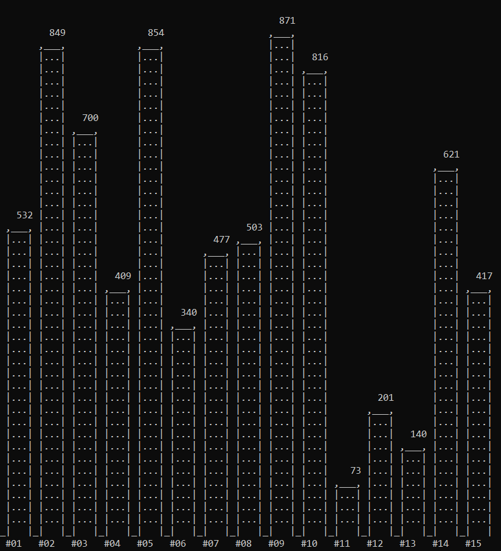

# Oracle Fun Stuff

Some simple scripts to have some fun while using Oracle Database in the SQL\*Plus command line.

Who said you **couldn't** have fun with Oracle Database?

> **Note:** Some messages, comments and variable names are in **Brazilian Portuguese**.

# Installation

Set the `SQLPATH` environment variable to point to the scripts location or copy the scripts you want to the same folder you keep your custom scripts.

# General help

- Please, use the command `@oracle-fun` to display a list of commands in this package.
- Scripts with colored output require a terminal that can handle [ANSI escape sequences](https://en.wikipedia.org/wiki/ANSI_escape_code).
- If output on some scripts are missing, truncated or messed up, please, try the following:
  - Adjust the terminal window dimensions (width, height)
  - Adjust the terminal window font family and size
  - Set a larger line size for script output on SQL*PLUS: `SET LINESIZE 1000`
  - Enable server output: `SET SERVEROUTPUT ON SIZE UNLIMITED`
  - Try setting some reasonable [defaults](https://github.com/feliposz/oracle-scripts/blob/master/default.sql) for SQL*PLUS

# Banner

- `@banner "Hello Oracle"` - Prints a message in ASCII art
- `@bannerbg "Hello Oracle"` - Prints a message in ASCII art with a big font
- `@bannerc "Hello Oracle"` - Prints a message in ASCII art with a bigger font

```
SQL> @banner "Hello Oracle"
  _   _          _   _                ___                          _
 | | | |   ___  | | | |   ___        / _ \   _ __    __ _    ___  | |   ___
 | |_| |  / _ \ | | | |  / _ \      | | | | | '__|  / _` |  / __| | |  / _ \
 |  _  | |  __/ | | | | | (_) |     | |_| | | |    | (_| | | (__  | | |  __/
 |_| |_|  \___| |_| |_|  \___/       \___/  |_|     \__,_|  \___| |_|  \___|

```

# Calendar

- `@cal_simp` - Prints a simple calendar
- `@cal_color` - Prints a calendar formatted as a table
- `@cal_tab` - Prints a colored calendar


# Charts

- All `chart_XXX` commands require that the label/group/category column be aliased as `lbl` and the value/numeric column must be aliased `val`.
- You pass a simple **one-line query** as a parameter. The query should be delimited by **double-quotation** marks.

## Horizontal Bar Chart

```
@chart_horiz "select 'Sample ' || lpad(rownum, 2, '0') as lbl, trunc(dbms_random.value(1, 1000)) as val from dual connect by level <= 15 order by 1"
```


## Vertical Bar Chart

```
@chart_bar "select '#' || lpad(rownum, 2, '0') as lbl, trunc(dbms_random.value(1, 1000)) as val from dual connect by level <= 15 order by 1"
```




## 3D Bar Chart

```
@chart_3d "select '#' || lpad(rownum, 2, '0') as lbl, trunc(dbms_random.value(1, 1000)) as val from dual connect by level <= 15 order by 1"
```


## Colored Bar Chart

```
@chart_color "select '#' || lpad(rownum, 2, '0') as lbl, trunc(dbms_random.value(1, 1000)) as val from dual connect by level <= 15 order by 1"
```


## Donut/Pie Chart

```
@chart_donut "select chr(64 + rownum) as lbl, trunc(dbms_random.value(1, 1000)) as val from dual connect by level <= 9 order by 1"
```


# Guitar

- `@guitar_fretboard` - Prints a guitar fretboard
- `@guitar_note A` - Prints a guitar fretboard showing all positions for a given note
- `@guitar_color A,B,C` - Prints a guitar fretboard with notes in color


# Miscellaneous

- `@ansi_colors` - Print some helpful information on how to use ANSI escape sequences to have colored output on SQL scripts.
- `@brasil` - Prints the Brazilian Flag in ASCII using an SQL query.
- `@gfx_gradient1`, `@gfx_gradient2`, `@gfx_gradient3` and `@gfx_misc` - Prints some graphical patterns
- `@xgh` and `@xgh_big` - Prints a small and a big ASCII art logo for the [Only Truly "Agile" Methodology](https://medium.com/@dekaah/22-axioms-of-the-extreme-go-horse-methodology-xgh-9fa739ab55b4) that is used by everyone (even by Tesla).

